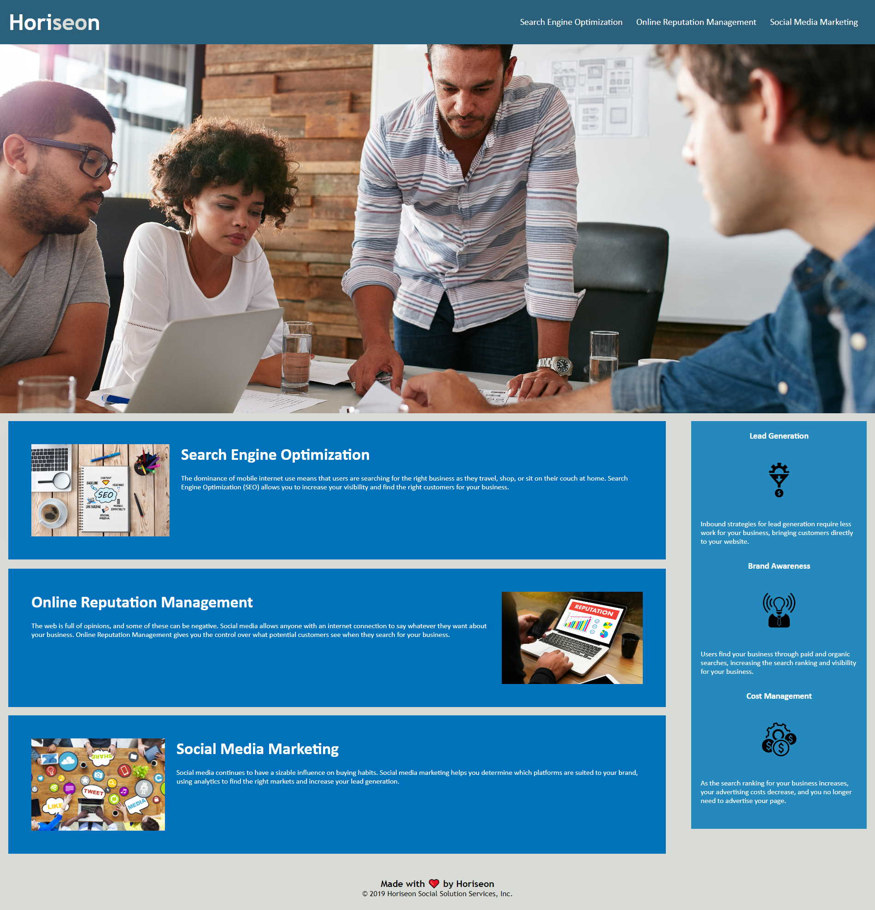

# "Horiseon" site

## Description
This professional site of the Herison. Company provides services:
- Search Engine Optiomization
- Online reputation management 
- Social Media Marketing.

Site follows [**accessibility**](https://developer.mozilla.org/en-US/docs/Learn/Accessibility) standards.
 
## Installation
n/a

## Usage

This site was built using [GitHub Pages](https://pages.github.com/).  Deployed page: https://olgagav.github.io/horiseon/ 

 

### Herison propose 3 services:
- Search Engine Optiomization
- Online reputation management 
- Social Media Marketing. 

Use links in navigation bar for quick access the topic.

Aside of the main page represented achivements of the company: 
- Lead geneation, 
- Brand Awarness, 
- Cost Management. 
 Site made with love by Horiseon. :tada:
## Credits

n/a

## License

n/a
